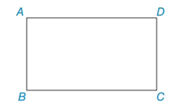

1. **sort.asm** program, which performs a bubble sort of 16 numbers in ascending order. The numbers are provided at addresses 0x100 to 0x10f, which are also the addresses of the sorted array upon completion.

2. **factorial.asm** program, which calculates $n!$ (n factorial) recursively according to the following algorithm. At the start of the run, $n$ is given at address 0x100 and the result will be written to address 0x101. It can be assumed that $n$ is small enough that no overflow occurs.
   ```c
   int factorial(int n)
   {
       if (n == 0)
           return 1;
       return n * factorial(n-1);
   }
   ```

3. **rectangle.asm** program, which draws a solid white rectangle on the screen (all pixels on the perimeter and inside the rectangle area are white):

   

   Where A is the top-left vertex, B is the bottom-left vertex, C is the bottom-right vertex, and D is the top-right vertex. The addresses of the rectangle's vertices relative to the start of the frame buffer are given at addresses 0x100 (A), 0x101 (B), 0x102 (C), 0x103 (D).

4. **disktest.asm** program, which performs a summation of the contents of sectors 0 to 3 on the hard disk and writes the result to sector 4. That is, each word in sector 4 will be the sum of the four corresponding words from sectors 0 to 3:
   ```c
   for (i = 0; i < 128; i++)
       sector4[i] = sector0[i] + sector1[i] + sector2[i] + sector3[i]
   ```