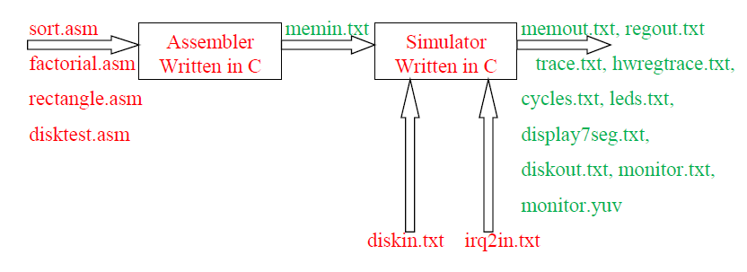

# Table of Contents:
1. [Project Diagram](#Project%20Diagram)
2. [Registers Table](#Registers%20Table)
3. [Main Memory and Instructions set](#Main%20Memory%20and%20Instructions%20set)
	1. [Opcodes Table](#Opcodes%20Table)
4. [Interrupts](#interrupts)
5. [Input/Output](#Input/Output)
6. [Timer](#timer)
7. [Leds](#Leds)
8. [Monitor](#Monitor)
9. [Hard Disk](#Hard%20Disk)
10. [Input/Output Files](#Input/Output%20Files)

# Project Diagram

# Registers Table

| Register Number | Register Name |           Purpose            |
| :-------------: | :-----------: | :--------------------------: |
|        0        |     $zero     |        Constant zero         |
|        1        |     $imm      |      Sign extended imm       |
|        2        |      $v0      |         Result value         |
|        3        |      $a0      |      Argument register       |
|        4        |      $a1      |      Argument register       |
|        5        |      $a2      |      Argument register       |
|        6        |      $a3      |      Argument register       |
|        7        |      $t0      |      Temporary register      |
|        8        |      $t1      |      Temporary register      |
|        9        |      $t2      |      Temporary register      |
|       10        |      $s0      |        Saved register        |
|       11        |      $s1      |        Saved register        |
|       12        |      $s2      |        Saved register        |
|       13        |      $gp      | Global pointer (static data) |
|       14        |      $sp      |        Stack pointer         |
|       15        |      $ra      |        Return address        |

# Main Memory and Instructions set

The main memory is 32 bits wide and 4096 lines deep. An instruction in the SIMP processor is encoded in one or two lines in memory, where the first line is given in the following format:

The `bigimm` bit determines whether an additional line is used in the instruction encoding: If its value is 1, the instruction will use an additional line that will contain a 32-bit constant.

The PC register is 12 bits wide. To advance to the next instruction (if there is no jump), the PC increments by one for instructions encoded in one line, or by two for instructions encoded in two lines.
During instruction decoding, the constant ("register 1") is determined in one of two ways:
If `bigimm == 0`, the constant will be imm8 after sign extension (duplicating bit 7 of the constant to bits 31:8).
If `bigimm == 1`, the constant is taken from the 32 bits in the second cell of the instruction encoding, imm32, and imm8 is not used.
An instruction encoded in one line in memory (`bigimm == 0`) is executed in one clock cycle.
An instruction encoded in two cells in memory (`bigimm == 1`) is executed in two clock cycles.

## Opcodes Table

| Opcode Number | Name |                           Meaning                            |
| :-----------: | :--: | :----------------------------------------------------------: |
|       0       | add  |                    R[rd] = R[rs] + R[rt]                     |
|       1       | sub  |                    R[rd] = R[rs] – R[rt]                     |
|       2       | mul  |                    R[rd] = R[rs] * R[rt]                     |
|       3       | and  |                    R[rd] = R[rs] & R[rt]                     |
|       4       |  or  |                    R[rd] = R[rs] \| R[rt]                    |
|       5       | xor  |                    R[rd] = R[rs] ^ R[rt]                     |
|       6       | sll  |                    R[rd] = R[rs] << R[rt]                    |
|       7       | sra  | R[rd] = R[rs] >> R[rt], arithmetic shift with sign extension |
|       8       | srl  |            R[rd] = R[rs] >> R[rt], logical shift             |
|       9       | beq  |                if (R[rs] == R[rt]) pc = R[rd]                |
|      10       | bne  |                if (R[rs] != R[rt]) pc = R[rd]                |
|      11       | blt  |                if (R[rs] < R[rt]) pc = R[rd]                 |
|      12       | bgt  |                if (R[rs] > R[rt]) pc = R[rd]                 |
|      13       | ble  |                if (R[rs] <= R[rt]) pc = R[rd]                |
|      14       | bge  |                if (R[rs] >= R[rt]) pc = R[rd]                |
|      15       | jal  |         R[rd] = next instruction address, pc = R[rs]         |
|      16       |  lw  |                   R[rd] = MEM[R[rs]+R[rt]]                   |
|      17       |  sw  |                   MEM[R[rs]+R[rt]] = R[rd]                   |
|      18       | reti |                      PC = IORegister[7]                      |
|      19       |  in  |              R[rd] = IORegister[R[rs] + R[rt]]               |
|      20       | out  |               IORegister [R[rs]+R[rt]] = R[rd]               |
|      21       | halt |                Halt execution, exit simulator                |

# Input/Output
The processor supports input/output using `in` and `out` instructions that access a "hardware registers" array as detailed in the table below. The initial values of the hardware registers upon exiting reset are 0.

| IORegister Number |     Name     | number bits |                                                                               Meaning                                                                                |
| :---------------: | :----------: | :---------: | :------------------------------------------------------------------------------------------------------------------------------------------------------------------: |
|         0         |  irq0enable  |      1      |                                                            IRQ 0 enabled if set to 1, otherwise disabled                                                             |
|         1         |  irq1enable  |      1      |                                                            IRQ 1 enabled if set to 1, otherwise disabled                                                             |
|         2         |  irq2enable  |      1      |                                                            IRQ 2 enabled if set to 1, otherwise disabled                                                             |
|         3         |  irq0status  |      1      |                                                            IRQ 0 status. Set to 1 when irq 0 is triggered                                                            |
|         4         |  irq1status  |      1      |                                                            IRQ 1 status. Set to 1 when irq 1 is triggered                                                            |
|         5         |  irq2status  |      1      |                                                            IRQ 2 status. Set to 1 when irq 2 is triggered                                                            |
|         6         |  irqhandler  |     12      |                                                                       PC of interrupt handler                                                                        |
|         7         |  irqreturn   |     12      |                                                                    PC of interrupt return address                                                                    |
|         8         |     clks     |     32      |                        cyclic clock counter. Starts from 0 and increments every clock. After reaching 0xffffffff, the counter rolls back to 0                        |
|         9         |     leds     |     32      |                                 Connected to 32 output pins driving 32 leds. Led number i is on when leds[i] == 1, otherwise its off                                 |
|        10         | display7seg  |     32      | Connected to 7-segment display of 8 digits. Each 4 bits displays one digit from 0 – F, where bits 3:0 control the rightmost digit, and bits 31:28 the leftmost digit |
|        11         | timerenable  |      1      |                                                                1: timer enabled 0: timer disabled                                                                 |
|        12         | timercurrent |     32      |                                                                        current timer counter                                                                         |
|        13         |   timermax   |     32      |                                                                           max timer value                                                                            |
|        14         |   diskcmd    |      2      |                                                        0 = no command 1 = read sector 2 = write sector                                                         |
|        15         |  disksector  |      7      |                                                                   sector number, starting from 0.                                                                    |
|        16         |  diskbuffer  |     12      |                   Memory address of a buffer containing the sector being read or written. Each sector will be read/written using DMA in 128 words                    |
|        17         |  diskstatus  |      1      |                                              0 = free to receive new command 1 = busy handling a read/write command                                               |
|        18         |   reserved   |             |                                                                       Reserved for future use                                                                        |
|        19         |   reserved   |             |                                                                       Reserved for future use                                                                        |
|        20         | monitoraddr  |     16      |                                                                    Pixel address in frame buffer                                                                     |
|        21         | monitordata  |      8      |                                                                Pixel luminance (gray) value (0 – 255)                                                                |
|        22         |  monitorcmd  |      1      |                                                             0 = no command 1 = write pixel to monitor                                                             |

# Interrupts

The SIMP processor supports 3 interrupts: irq0, irq1, and irq2.

*   **Interrupt 0** is associated with the timer; assembly code can program the interval at which the interrupt occurs.
*   **Interrupt 1** is associated with the simulated hard disk, which the disk uses to notify the processor when it has finished a read or write command.
*   **Interrupt 2** is connected to an external line, irq2. An input file for the simulator determines when this interrupt occurs.

In the clock cycle where an interrupt is received, the corresponding register—irq0status, irq1status, or irq2status—is set to 1. If multiple interrupts are received in the same clock cycle, the corresponding status registers will all be set.

Every clock cycle, the processor checks the signal:
`irq = (irq0enable & irq0status) | (irq1enable & irq1status) | (irq2enable & irq2status)`

If `irq == 1`, and the processor is not in the second cycle of a two-cycle instruction (`bigimm == 1`), and the processor is not currently inside an interrupt service routine (ISR), the processor jumps to the ISR address stored in the hardware register `irqhandler`. This means that in this clock cycle, the instruction at `PC = irqhandler` is executed instead of the original PC. In the same clock cycle, the original PC is saved into the hardware register `irqreturn`.

However, if `irq == 1` but the processor is still inside a previous ISR (meaning it has not yet executed the `reti` instruction), the processor will ignore the signal, will not jump, and will continue executing the current ISR code. Once the processor returns from the interrupt, it will check `irq` again and jump back to the ISR if necessary.

The assembly code within the ISR should check the `irqstatus` bits and clear them after the interrupt has been handled.

Returning from an ISR is performed using the `reti` instruction, which sets `PC = irqreturn`.

# Timer

The SIMP processor supports a 32-bit timer connected to interrupt irq0. It is enabled when `timerenable = 1`.

The current timer counter value is stored in the hardware register `timercurrent`. In every clock cycle where the timer is enabled, the `timercurrent` register is incremented by one.

In the clock cycle where `timercurrent = timermax`, `irqstatus0` is set to 1. In this same clock cycle, instead of incrementing `timercurrent`, it is reset to zero.

# Leds

32 LEDs are connected to the SIMP processor. Assembly code turns the LEDs on or off by writing a 32-bit word to the `leds` hardware register, where bit 0 controls LED 0 (the rightmost) and bit 31 controls LED 31 (the leftmost).

# Monitor

A monochromatic monitor with a resolution of 256x256 pixels is connected to the SIMP processor. Each pixel is represented by 8 bits representing the pixel's gray level (luminance), where 0 indicates black, 255 indicates white, and any other value in the range describes a gray shade between black and white linearly.

The screen has an internal frame buffer of size 256x256 containing the pixel values currently displayed on the screen. At the start of operation, all values contain zero. The buffer contains rows of 256 bytes corresponding to the screen scan from top to bottom. That is, row 0 in the buffer contains the pixels of the top row on the screen. Within each row, the pixel scan is from left to right.

*   The **monitoraddr** register contains the buffer offset of the pixel the processor wants to write.
*   The **monitordata** register contains the pixel value the processor wants to write.
*   The **monitorcmd** register is used for writing a pixel. In the clock cycle where a write of `monitorcmd=1` occurs using the `out` instruction, the pixel whose value is in the `monitordata` register is updated on the screen.
*   Reading from the **monitorcmd** register using the `in` instruction will return the value 0.

# Hard Disk

A hard disk is connected to the SIMP processor, consisting of 128 sectors, where each sector contains 128 lines with a width of 32 bits. The disk is connected to interrupt number 1 (irq1) and uses DMA to copy a sector from memory to the disk or vice versa.

The initial content of the hard disk is provided in the input file `diskin.txt`, and the disk content at the end of the run will be written to the file `diskout.txt`.

Before issuing a read or write command for a sector to the hard disk, the assembly code checks that the disk is free to receive a new command by checking the `diskstatus` hardware register.

If the disk is free, the sector number to be read or written is written to the `disksector` register, and the memory address is written to the `diskbuffer` register. Only after these two registers are initialized is a write or read command issued by writing to the `diskcmd` hardware register.

The disk's processing time for a read or write command is 1024 clock cycles. During this time, the buffer content must be copied to the disk if it was a write command, or conversely, the sector content must be copied to the buffer if it was a read command.

As long as 1024 clock cycles have not passed since the command was received, the `diskstatus` register will indicate that the disk is busy. After 1024 clock cycles, the `diskcmd` and `diskstatus` registers will simultaneously change to the value 0, and the disk will signal an interrupt by setting `irqstatus1` to 1.

# Input/Output Files

The simulator simulates the fetch-decode-execute loop. At the start of the run, PC=0. In each iteration, the next instruction is fetched from the address in the PC, decoded according to the encoding, and then executed. At the end of the instruction, the PC is updated to PC+1 or PC+2 (depending on whether the instruction is encoded in a single cell or two cells), unless a jump instruction was executed that updates the PC to a different value. The run ends and the simulator exits when a HALT instruction is executed.

The simulator will be written in C and compiled into a command-line application that receives 13 command-line parameters according to the following execution line:
`sim.exe memin.txt diskin.txt irq2in.txt memout.txt regout.txt trace.txt hwregtrace.txt cycles.txt leds.txt display7seg.txt diskout.txt monitor.txt monitor.yuv`

*   **memin.txt**: An input file in text format containing the contents of the main memory at the start of the run. Each line contains the content of a memory row, starting from address zero, in 8-digit hexadecimal format. If the number of lines in the file is less than 4096, it is assumed that the rest of the memory above the last initialized address is zeroed. You can assume the input file is valid.
*   **diskin.txt**: An input file containing the contents of the hard disk at the start of the run, where each line contains 8 hexadecimal digits. If the number of lines is less than the disk size, the rest of the disk is assumed to be zeroed.
*   **irq2in.txt**: An input file containing the clock cycle numbers in which the external interrupt line `irq2` rose to 1. Each such clock cycle is on a separate line in ascending order. The line rises to 1 for a single clock cycle and then drops back to zero (unless another line appears in the file for the next clock cycle).
*   **Input File Requirements**: The three input files must exist even if they are not used in your code (for example, for assembly code that does not use the hard disk, a `diskin.txt` file must still exist, though its content may be left empty).
*   **memout.txt**: An output file in the same format as `memin.txt`, containing the contents of the main memory at the end of the run.
*   **regout.txt**: An output file containing the contents of registers R2-R15 at the end of the run (note that the constants R0–R1 should not be printed). Each line will be written in 8 hexadecimal digits.
*   **trace.txt**: An output file containing a line of text for every instruction executed by the processor in the following format:
    `CYCLE PC INST R0 R1 R2 R3 R4 R5 R6 R7 R8 R9 R10 R11 R12 R13 R14 R15`
    Every field is printed in hexadecimal digits.
    *   **CYCLE**: The clock cycle in which the instruction is executed, encoded in 8 digits. If an instruction is executed in two clock cycles (`bigimm == 1`), the second of the two clock cycles will be printed in this field.
    *   **PC**: The Program Counter of the instruction (printed in 3 digits).
    *   **INST**: The encoding of the first cell of the instruction as read from memory (8 digits).
    *   **Registers**: The contents of the registers *before* the execution of the instruction (meaning the result of the execution can only be seen in the registers of the next line). Each register is printed in 8 digits.
    *   **R0/R1**: In the R0 field, write 8 zeros. In the R1 field, write the content of the 32-bit constant after sign extension, if required.
*   **hwregtrace.txt**: An output file containing a line of text for every read or write to a hardware register (using `in` and `out` instructions) in the following format:
    `CYCLE READ/WRITE NAME DATA`
    *   **CYCLE**: The clock cycle number in 8 hexadecimal digits.
    *   **READ/WRITE**: Contains either `READ` or `WRITE` depending on the operation.
    *   **NAME**: The name of the hardware register as it appears in the table.
    *   **DATA**: The value written or read in 8 hexadecimal digits.
*   **cycles.txt**: An output file containing the number of clock cycles the program ran, in 8 hexadecimal digits.
*   **leds.txt**: Contains the status of the 32 LEDs. In every clock cycle that one of the LEDs changes (turns on or off), write a line with two numbers and a space between them: the left number is the clock cycle in 8 hex digits, and the right number is the state of all 32 LEDs in 8 hexadecimal digits.
*   **display7seg.txt**: Contains the status of the 7-segment display. In every clock cycle that the display changes, write a line with two numbers and a space between them: the left number is the clock cycle in 8 hex digits, and the right number is the display value in 8 hexadecimal digits.
*   **diskout.txt**: An output file in the same format as `diskin.txt`, containing the contents of the hard disk at the end of the run.
*   **monitor.txt**: Contains the pixel values of the screen at the end of the run. Each line contains a single pixel value (8 bits) in two hexadecimal digits. The screen scan is from top to bottom and left to right (e.g., the first line contains the top-left pixel). If the number of lines is less than the number of pixels on the screen, the remaining pixels are assumed to be zero.
*   **monitor.yuv**: A binary file containing the same data as `monitor.txt`, which can be displayed on screen using the `yuvplayer` software.